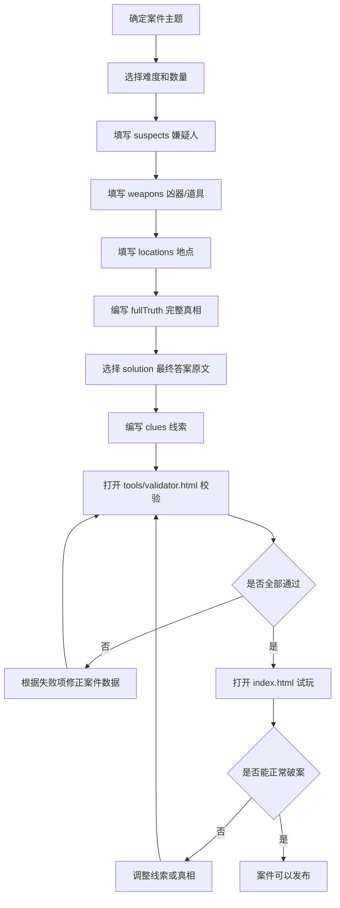

# CleverGrid 案件编写规范

这份文档用于指导非技术维护者新增案件。目标是：按照固定顺序填写内容，再用校验工具检查，最后试玩确认。

新增案件时，只需要关心 7 类内容：

1. 案件标题
2. 难度
3. 嫌疑人 suspects
4. 凶器 weapons
5. 地点 locations
6. 线索 clues
7. 答案 solution 与完整真相 fullTruth

## 案件结构说明

每个案件都由三组卡片和一组线索组成：

- suspects：嫌疑人
- weapons：凶器、物品、关键道具
- locations：地点
- clues：玩家推理用的文字线索
- solution：最终结案答案，只包含凶手、凶器、地点
- fullTruth：完整真相，说明每个嫌疑人分别对应哪个凶器和地点

一个案件里的嫌疑人、凶器、地点数量必须一致。

例如：

- 3 个嫌疑人，就必须有 3 个凶器、3 个地点
- 4 个嫌疑人，就必须有 4 个凶器、4 个地点
- 5 个嫌疑人，就必须有 5 个凶器、5 个地点

## 难度参考

| 难度 | 人数 | 推荐线索数 |
|--------|--------|--------|
| 入门 | 3 | 5-7 |
| 普通 | 4 | 8-10 |
| 困难 | 5 | 12-15 |
| 专家 | 5 | 15+ |

难度主要由信息量和排除关系决定。

不要单纯通过减少线索制造难度。线索太少会让玩家觉得无从下手，而不是觉得谜题更聪明。

## suspects 规则

suspects 是嫌疑人列表。

每个嫌疑人需要填写：

- id：唯一编号
- name：显示给玩家看的名字
- icon：显示在卡片和网格里的图标
- desc：人物描述
- traits：可用于推理的人物特征

填写建议：

- id 使用 `S1`、`S2`、`S3` 这样的编号。
- 同一个案件里，嫌疑人 id 不能重复。
- name 尽量短，避免卡片显示太挤。
- traits 应该包含能帮助推理的特征，例如“戴眼镜”“左撇子”“红色围巾”。
- 不要让两个嫌疑人的 traits 完全一样，否则线索会变得难写。

好的 suspects 设计：

- S1：有明确身份
- S2：有明显外观特征
- S3：有可被线索引用的行为或习惯

不建议：

- 所有人都没有特征
- 所有人描述很长但无法用于推理
- id 写成中文名，后续容易填错

## weapons 规则

weapons 是凶器、道具或关键物品列表。

每个凶器需要填写：

- id：唯一编号
- name：显示名称
- icon：图标
- tag：物品类型
- desc：物品描述

填写建议：

- id 使用 `W1`、`W2`、`W3` 这样的编号。
- tag 用于快速理解物品类型，例如“钝器”“利器”“饮料”“工具”“证物”。
- 每个物品最好有不同特征，方便线索引用。
- 如果案件不是杀人案，weapons 也可以理解为“关键道具”。

## locations 规则

locations 是地点列表。

每个地点需要填写：

- id：唯一编号
- name：显示名称
- icon：图标
- tag：地点类型
- desc：地点描述

填写建议：

- id 使用 `L1`、`L2`、`L3` 这样的编号。
- tag 可以写“室内”“户外”“限制区域”“公共区域”等。
- 地点之间要有明显差异，方便线索表达。
- 不建议使用过长地点名。

## clues 规则

clues 是线索列表。玩家主要通过这些线索完成推理。

线索可以表达几种关系：

- 某人对应某物：例如“园丁拿着铜钥匙。”
- 某人对应某地：例如“厨师一直待在厨房。”
- 某物对应某地：例如“银色手电筒出现在仓库。”
- 排除关系：例如“戴眼镜的人不在花园。”
- 条件关系：例如“如果管家在大厅，那么烛台也在大厅。”
- 二选一关系：例如“红围巾的人要么在阁楼，要么拿着手套。”

填写要求：

- clues 数量必须大于 0。
- 线索必须足够推出唯一答案。
- 不要出现和 fullTruth 矛盾的线索。
- 不要把答案直接写得太明显，除非是入门案件。
- 每条线索尽量只表达一个重点。

## 案件设计推荐流程

不要从线索开始设计。

推荐顺序：

1. 先设计完整真相（fullTruth）
2. 确定最终答案（solution）
3. 设计关键排除关系
4. 编写线索
5. 使用校验工具检查
6. 实际试玩验证

原则：

真相决定线索。

不要先写线索，再拼凑真相。

## solution 规则

solution 是最终结案答案，由 3 个部分组成：

- 凶手的 suspect id
- 凶器的 weapon id
- 地点的 location id

例如：

```text
S2-W3-L1
```

维护者只需要填写答案原文：

```text
S2-W3-L1
```

如果项目后续提供案件工具，会自动生成 solution 字段。

维护者无需关心编码细节。

注意：

- 顺序必须是“嫌疑人-凶器-地点”。
- id 必须真实存在。
- 中间使用英文短横线 `-`。
- 不要使用中文破折号。

## fullTruth 规则

fullTruth 是完整真相。它不只是最终答案，而是整个案件所有人物的真实对应关系。

每一行代表：

```text
嫌疑人 id - 凶器 id - 地点 id
```

例如：

```text
S1-W1-L2
S2-W3-L1
S3-W2-L3
```

fullTruth 必须满足：

- 覆盖所有嫌疑人。
- 每个嫌疑人只能出现一次。
- 每个凶器最好只出现一次。
- 每个地点最好只出现一次。
- 每个 id 都必须存在于 suspects、weapons、locations。
- solution 必须是 fullTruth 中某一行。

简单理解：

fullTruth 是“标准答案表”，solution 是“玩家最终要提交的那一行”。

## 新增案件时的填写顺序

推荐按下面顺序写：

1. 确定案件主题和标题。
2. 确定难度，也就是 3 人、4 人还是 5 人。
3. 填写 suspects。
4. 填写 weapons。
5. 填写 locations。
6. 先写 fullTruth，确定每个人、每件物品、每个地点的真实组合。
7. 从 fullTruth 中选择一行作为 solution 原文。
8. 编写 clues。
9. 打开校验工具检查数据。
10. 打开游戏试玩，确认可以正常破案。

## 常见错误示例

### 错误 1：三类数量不一致

错误：

```text
suspects 有 4 个
weapons 有 3 个
locations 有 4 个
```

正确：

```text
suspects、weapons、locations 必须都是 4 个
```

### 错误 2：solution 使用了不存在的 id

错误：

```text
solution 原文：S5-W1-L1
但 suspects 里只有 S1、S2、S3
```

正确：

```text
solution 中的每个 id 都必须能在对应列表里找到
```

### 错误 3：fullTruth 没有覆盖所有嫌疑人

错误：

```text
suspects 有 S1、S2、S3
fullTruth 只写了 S1、S2
```

正确：

```text
fullTruth 必须包含 S1、S2、S3
```

### 错误 4：线索数量为 0

错误：

```text
clues 为空
```

正确：

```text
至少写 1 条线索。正式案件建议写 5 条以上。
```

### 错误 5：线索和真相矛盾

错误：

```text
fullTruth 写 S1 在 L1
clues 写 S1 不在 L1
```

正确：

```text
每条线索都必须符合 fullTruth
```

### 错误 6：solution 顺序写反

错误：

```text
W2-S1-L3
```

正确：

```text
S1-W2-L3
```

顺序永远是：

```text
嫌疑人 - 凶器 - 地点
```

## 新增案件流程图



## 最后检查清单

发布前确认：

- 标题清楚。
- 难度合理。
- suspects、weapons、locations 数量一致。
- 每个对象都有 id。
- solution 原文顺序正确。
- solution 原文已经确定，且来自 fullTruth 中的某一行。
- fullTruth 覆盖所有嫌疑人。
- clues 至少 1 条，且不与真相矛盾。
- 校验工具全部通过。
- 游戏中可以完成破案。
