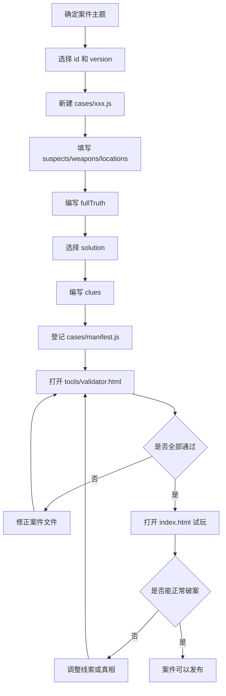

# CleverGrid 案件编写规范

这份文档用于指导维护者新增案件。完整字段定义见 [case-schema.md](case-schema.md)，可复制示例见 [example-case.md](example-case.md)。

当前项目的案件不再集中写在 `data.js` 中。每个案件都应该放在 `cases/` 下的独立 JS 文件里，并在 `cases/manifest.js` 中登记。

## 新增案件只需要关心的内容

1. 案件 id
2. version
3. 案件标题 title
4. 难度 difficulty
5. 开场描述 intro
6. 嫌疑人 suspects
7. 凶器/道具 weapons
8. 地点 locations
9. 线索 clues
10. 完整真相 fullTruth
11. 最终答案 solution

## 推荐设计顺序

不要从线索开始设计。

推荐顺序：

1. 确定案件主题和标题。
2. 确定案件 id，例如 `rainy-museum-theft`。
3. 选择人数规模：3 人、4 人或 5 人。
4. 填写 suspects、weapons、locations。
5. 先写 fullTruth，确定每个人、每件物品、每个地点的真实组合。
6. 从 fullTruth 中选择一行作为 solution 原文。
7. 将 solution 原文转成 Base64，写入 `solution` 字段。
8. 围绕 fullTruth 编写 clues。
9. 打开 `tools/validator.html` 校验。
10. 打开 `index.html` 手动试玩。

原则：真相决定线索。不要先写线索，再拼凑真相。

## id 命名规则

案件 id 使用小写英文和短横线：

```text
rainy-museum-theft
```

要求：

- 只使用小写英文字母、数字和英文短横线 `-`。
- 不使用中文、空格、下划线或标点。
- 文件名、注册表 key、manifest 条目必须一致。
- 案件发布后不要修改 id，否则旧存档会失去对应关系。

对象 id 建议：

- 嫌疑人：`S1`、`S2`、`S3`
- 凶器/道具：`W1`、`W2`、`W3`
- 地点：`L1`、`L2`、`L3`

## version 使用规则

新案件从：

```js
version: 1
```

开始。

如果只改错别字或描述润色，通常不用升级。
如果修改关键线索、fullTruth、solution、人物/物品/地点列表，建议 version 加 1。

## 难度参考

| 难度 | 人数 | 推荐线索数 |
| --- | --- | --- |
| 入门 | 3 | 5-7 |
| 普通 | 4 | 8-10 |
| 困难 | 5 | 12-15 |
| 专家 | 5 | 15+ |

不要单纯通过减少线索制造难度。线索太少会让玩家觉得无从下手。

## suspects 规则

每个嫌疑人需要：

```js
{ id: 'S1', name: '值夜班保安', icon: '🧢', desc: '负责夜间巡逻。', traits: '戴蓝色帽子' }
```

填写建议：

- name 尽量短，避免卡片显示太挤。
- desc 用于人物叙事。
- traits 应该能被线索引用，例如“戴眼镜”“左撇子”“红色围巾”。
- 同一个案件内 suspects id 不能重复。

## weapons 规则

每个凶器、道具或关键物品需要：

```js
{ id: 'W1', name: '铜制钥匙', icon: '🗝️', tag: '钥匙', desc: '可以打开后门。' }
```

填写建议：

- 如果案件不是杀人案，weapons 可以理解为“关键道具”。
- tag 用于快速理解类型，例如“钝器”“工具”“证物”“饮料”。
- 每个物品最好有不同特征，方便写线索。

## locations 规则

每个地点需要：

```js
{ id: 'L1', name: '主展厅', icon: '🏛️', tag: '展区', desc: '被盗画作原本挂在这里。' }
```

填写建议：

- 地点之间要有明显差异。
- tag 可以写“室内”“户外”“限制区域”“公共区域”等。
- 不建议使用过长地点名。

## clues 写法要求

线索可以表达：

- 某人对应某物：例如“园丁拿着铜钥匙。”
- 某人对应某地：例如“厨师一直待在厨房。”
- 某物对应某地：例如“银色手电筒出现在仓库。”
- 排除关系：例如“戴眼镜的人不在花园。”
- 条件关系：例如“如果管家在大厅，那么烛台也在大厅。”
- 二选一关系：例如“红围巾的人要么在阁楼，要么拿着手套。”

填写要求：

- 至少 1 条线索，正式案件建议 5 条以上。
- 每条线索尽量只表达一个重点。
- 线索必须和 fullTruth 一致。
- 不要直接写最终答案，除非是新手教学关。
- Validator 当前不会理解线索语义，也不会判断唯一解，必须手动试玩。

## fullTruth 写法要求

fullTruth 是完整真相。每一行代表：

```text
嫌疑人 id - 凶器/道具 id - 地点 id
```

代码格式：

```js
fullTruth: [
    ['S1', 'W2', 'L1'],
    ['S2', 'W3', 'L2'],
    ['S3', 'W1', 'L3']
]
```

要求：

- 覆盖所有嫌疑人。
- 每个嫌疑人只能出现一次。
- 每个凶器/道具应该只出现一次。
- 每个地点应该只出现一次。
- 每个 id 都必须存在。
- 行数必须等于嫌疑人数。

## solution 规则

solution 是最终结案答案，只包含一行：

```text
S3-W1-L3
```

这行必须来自 fullTruth。

当前案件文件中 `solution` 存 Base64 编码：

```js
solution: "UzMtVzEtTDM="
```

未来 Editor 应让维护者填写原文 `S3-W1-L3`，再自动导出编码后的 `solution`。

## 当前案件文件模板

```js
window.CLEVERGRID_CASE_REGISTRY = window.CLEVERGRID_CASE_REGISTRY || {};
window.CLEVERGRID_CASE_REGISTRY["rainy-museum-theft"] = {
    id: "rainy-museum-theft",
    version: 1,
    title: "雨夜美术馆失窃案",
    difficulty: "入门级",
    intro: "暴雨之夜，美术馆最珍贵的一幅画作不翼而飞。",
    suspects: [],
    weapons: [],
    locations: [],
    clues: [],
    solution: "UzMtVzEtTDM=",
    fullTruth: []
};
```

## 新增案件标准流程



## Validator 会检查什么

- case id 是否存在。
- case id 是否重复。
- version 是否存在。
- title 是否存在。
- suspects / weapons / locations 是否为空。
- suspects / weapons / locations 是否都有 id。
- suspects / weapons / locations 内部 id 是否重复。
- suspects / weapons / locations 数量是否一致。
- solution 是否能解码为三段 id。
- solution 中的嫌疑人、物品、地点是否存在。
- fullTruth 是否覆盖所有嫌疑人。
- fullTruth 每行 id 是否有效。
- fullTruth 是否完整。
- solution 是否对应到 fullTruth。
- clues 数量是否大于 0。

## 最后检查清单

发布前确认：

- 文件名和案件 id 一致。
- 案件 id 已加入 `cases/manifest.js`。
- version 已填写。
- suspects、weapons、locations 数量一致。
- 每个对象都有唯一 id。
- fullTruth 完整。
- solution 解码后来自 fullTruth。
- clues 至少 1 条，且不与真相矛盾。
- `tools/validator.html` 全部通过。
- `index.html` 可以试玩并破案。
