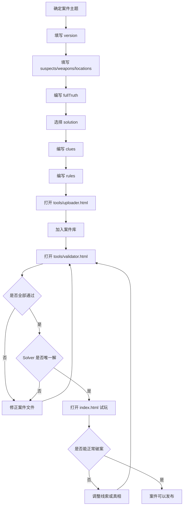

# CleverGrid 案件编写规范

这份文档用于指导维护者新增案件。完整字段定义见 [case-schema.md](case-schema.md)，可复制示例见 [example-case.md](example-case.md)。

当前项目的正式案件存放在 `cases/case-xxx.json` 中，并由 `case-index.json` 统一管理。新增案件应先通过 `tools/uploader.html` 校验，再加入案件库。

## 新增案件只需要关心的内容

1. version
2. 案件标题 title
3. 难度 difficulty
4. 开场描述 intro
5. 嫌疑人 suspects
6. 凶器/道具 weapons
7. 地点 locations
8. 线索 clues
9. 结构化规则 rules
10. 完整真相 fullTruth
11. 最终答案 solution

## 推荐设计顺序

不要从线索开始设计。

推荐顺序：

1. 确定案件主题和标题。
2. 选择人数规模：3 人、4 人或 5 人。
3. 填写 suspects、weapons、locations。
4. 先写 fullTruth，确定每个人、每件物品、每个地点的真实组合。
5. 从 fullTruth 中选择一行作为 `solution`。
6. 按 `{ suspect, weapon, location }` 写入 `solution` 字段。
7. 围绕 fullTruth 编写 clues。
8. 把 clues 转成机器可读的 rules。
9. 打开 `tools/uploader.html` 校验并加入案件库。
10. 打开 `tools/validator.html` 校验正式案件库。
11. 打开 `index.html` 手动试玩。

原则：真相决定线索。不要先写线索，再拼凑真相。

## id 命名规则

正式案件 id 由系统自动生成，格式固定为：

```text
case-001
```

要求：

- 固定 `case-` 前缀。
- 数字固定三位。
- 自动递增。
- 不需要用户手动填写。
- 不允许重复。

对象 id 建议：

- 嫌疑人：`S1`、`S2`、`S3`
- 凶器/道具：`W1`、`W2`、`W3`
- 地点：`L1`、`L2`、`L3`

## version 使用规则

新案件从：

```js
version: 1
```

开始。

如果只改错别字或描述润色，通常不用升级。
如果修改关键线索、fullTruth、solution、人物/物品/地点列表，建议 version 加 1。

## 难度参考

| 难度 | 人数 | 推荐线索数 |
| --- | --- | --- |
| 入门 | 3 | 5-7 |
| 普通 | 4 | 8-10 |
| 困难 | 5 | 12-15 |
| 专家 | 5 | 15+ |

不要单纯通过减少线索制造难度。线索太少会让玩家觉得无从下手。

## suspects 规则

每个嫌疑人需要：

```js
{ id: 'S1', name: '值夜班保安', icon: '🧢', desc: '负责夜间巡逻。', traits: '戴蓝色帽子' }
```

填写建议：

- name 尽量短，避免卡片显示太挤。
- desc 用于人物叙事。
- traits 应该能被线索引用，例如“戴眼镜”“左撇子”“红色围巾”。
- 同一个案件内 suspects id 不能重复。

## weapons 规则

每个凶器、道具或关键物品需要：

```js
{ id: 'W1', name: '铜制钥匙', icon: '🗝️', tag: '钥匙', desc: '可以打开后门。' }
```

填写建议：

- 如果案件不是杀人案，weapons 可以理解为“关键道具”。
- tag 用于快速理解类型，例如“钝器”“工具”“证物”“饮料”。
- 每个物品最好有不同特征，方便写线索。

## locations 规则

每个地点需要：

```js
{ id: 'L1', name: '主展厅', icon: '🏛️', tag: '展区', desc: '被盗画作原本挂在这里。' }
```

填写建议：

- 地点之间要有明显差异。
- tag 可以写“室内”“户外”“限制区域”“公共区域”等。
- 不建议使用过长地点名。

## clues 写法要求

线索可以表达：

- 某人对应某物：例如“园丁拿着铜钥匙。”
- 某人对应某地：例如“厨师一直待在厨房。”
- 某物对应某地：例如“银色手电筒出现在仓库。”
- 排除关系：例如“戴眼镜的人不在花园。”

填写要求：

- 至少 1 条线索，正式案件建议 5 条以上。
- 每条线索尽量只表达一个重点。
- 线索必须和 fullTruth 一致。
- 不要直接写最终答案，除非是新手教学关。
- clues 面向玩家展示，可以写得自然、有剧情感。
- Validator 不会直接理解 clues 的自然语言语义；当前 Solver 只读取 `rules`。
- 当前正式案件不要依赖条件关系、二选一关系、前后顺序或相邻关系，除非它们已经被拆成 `same` / `notSame` rules。

当前格式仍可使用字符串线索：

```js
clues: [
    "园丁拿着铜钥匙。"
]
```

未来 Uploader/Solver 阶段可以升级为带 id 的写法：

```js
clues: [
    { id: "C1", text: "园丁拿着铜钥匙。" }
]
```

## rules 写法要求

rules 是给 Validator、Solver 和 Uploader 使用的结构化线索。

推荐格式：

```js
rules: [
    {
        id: "R1",
        type: "same",
        left: "S1",
        right: "W1",
        note: "对应线索：园丁拿着铜钥匙。"
    }
]
```

当前只支持两种 `type`：

- `same`：left 和 right 属于同一组真相。
- `notSame`：left 和 right 不属于同一组真相。

示例：

```js
{ id: "R1", type: "same", left: "S1", right: "W2", note: "对应线索：园丁拿着蓝色工具箱。" }
```

含义：`S1` 使用 `W2`。

```js
{ id: "R2", type: "notSame", left: "W1", right: "L3", note: "对应线索：铜钥匙不在仓库。" }
```

含义：`W1` 不在 `L3`。

填写要求：

- 每条 rule 必须有 id。
- rule id 不能重复。
- `left` / `right` 必须存在于 suspects、weapons、locations。
- `left` / `right` 不能来自同一分类。
- `sourceClueId` 如果填写，必须对应一条 clue 的 id。
- 一条 clue 可以对应多条 rules。
- rules 必须与 fullTruth 一致。
- 新增案件应包含 rules，方便 Validator 和 Solver 判断唯一解。
- 当前游戏 UI 仍按字符串显示 clues，所以正式可玩的案件暂时应继续使用字符串 clues；`sourceClueId` 可以等 UI 兼容 clue id 后再填写。

完整示例：

```js
clues: [
    "园丁拿着蓝色工具箱。",
    "铜钥匙不在仓库。"
],
rules: [
    { id: "R1", type: "same", left: "S1", right: "W2", note: "对应线索：园丁拿着蓝色工具箱。" },
    { id: "R2", type: "notSame", left: "W1", right: "L3", note: "对应线索：铜钥匙不在仓库。" }
]
```

## fullTruth 写法要求

fullTruth 是完整真相。每一行代表：

```text
嫌疑人 id - 凶器/道具 id - 地点 id
```

代码格式：

```js
fullTruth: [
    ['S1', 'W2', 'L1'],
    ['S2', 'W3', 'L2'],
    ['S3', 'W1', 'L3']
]
```

要求：

- 覆盖所有嫌疑人。
- 每个嫌疑人只能出现一次。
- 每个凶器/道具应该只出现一次。
- 每个地点应该只出现一次。
- 每个 id 都必须存在。
- 行数必须等于嫌疑人数。

## solution 规则

solution 是最终结案答案，只包含一行真相。

这行必须来自 fullTruth。

当前案件文件中 `solution` 使用结构化对象：

```js
solution: {
    suspect: "S3",
    weapon: "W1",
    location: "L3"
}
```

新案件和 Uploader 都必须使用对象格式。
不要使用旧数组格式或旧版 Base64 字符串。

## 当前案件文件模板

这是提交给 Uploader 的草稿 JSON。正式 `id` 和文件名会在加入案件库时自动生成。

```json
{
  "version": 1,
  "title": "雨夜美术馆失窃案",
  "difficulty": "入门级",
  "intro": "暴雨之夜，美术馆最珍贵的一幅画作不翼而飞。",
  "suspects": [],
  "weapons": [],
  "locations": [],
  "clues": [],
  "rules": [],
  "solution": {
    "suspect": "S3",
    "weapon": "W1",
    "location": "L3"
  },
  "fullTruth": []
}
```

## 新增案件标准流程



## Validator 会检查什么

- case id 是否存在。
- case id 是否重复。
- version 是否存在。
- title 是否存在。
- suspects / weapons / locations 是否为空。
- suspects / weapons / locations 是否都有 id。
- suspects / weapons / locations 内部 id 是否重复。
- suspects / weapons / locations 数量是否一致。
- solution 是否能解析为三段 id。
- solution 中的嫌疑人、物品、地点是否存在。
- fullTruth 是否覆盖所有嫌疑人。
- fullTruth 每行 id 是否有效。
- fullTruth 是否完整。
- solution 是否对应到 fullTruth。
- clues 数量是否大于 0。
- rules 是否存在；当前没有 rules 只给 warning。
- rules 是否为数组。
- rule id 是否存在且不重复。
- rule type 是否为 same / notSame。
- rule left / right 是否存在于 suspects / weapons / locations。
- rule left / right 是否来自不同分类。
- rule sourceClueId 如果存在，是否能在 clues 中找到。
- rule 是否与 fullTruth 一致。
- Solver 是否有解。
- Solver 是否唯一解。
- Solver 唯一解是否匹配 fullTruth。

## 最后检查清单

发布前确认：

- Uploader 已自动分配 `case-xxx`。
- `case-index.json` 已包含案件。
- version 已填写。
- suspects、weapons、locations 数量一致。
- 每个对象都有唯一 id。
- fullTruth 完整。
- solution 解析后来自 fullTruth。
- clues 至少 1 条，且不与真相矛盾。
- 新增案件应包含 rules，且 rules 与 fullTruth 一致。
- `tools/validator.html` 全部通过，并显示 Solver 唯一解。
- `index.html` 可以试玩并破案。
